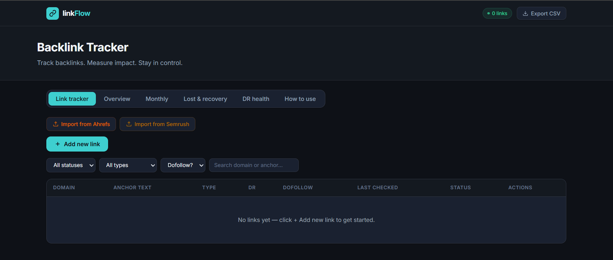

**linkFlow — The Strategist’s Backlink Tracker**
linkFlow is a custom dashboard I designed to solve a major pain point in technical SEO: Backlink Data Fragmentation. Instead of managing messy, static spreadsheets, I built this interface to provide a real-time visual pulse on link-building health, net growth, and "link rot.

**🔗[LinkFlow - Backlink Tracker](https://bhuvaneswari-seo.github.io/linkFlow-Backlink-Tracker/) - Why I Designed This**

As a specialist focusing on SEO and growth, I realized that standard "Lost Link" reports from major tools can be difficult to action quickly. I designed linkFlow with a specific workflow to prioritize strategy:

**Net Gain Monitoring:** Track actual growth by subtracting "Lost" links from "Live" acquisitions in real-time.

**Quality Control (DR Distribution)**: Instant visualization of the Domain Rating (DR) profile to ensure outreach efforts are hitting high-authority targets.

**Actionable Maintenance:** Automated logic that flags links that haven't been verified recently, preventing "link rot" from going unnoticed.

**🔐Key Features for SEO Managers**

**Smart CSV Mapping:** Automatically recognizes and imports data exports from Ahrefs and Semrush. No manual column re-formatting required.

**Dynamic Visualizations:** Integrated charts for Link Velocity and Authority Distribution using Chart.js.

**Privacy-Centric:** All data is processed locally in the browser via localStorage. Client link data is never sent to an external server.

**Workflow Filters:** Quickly isolate links by Month, Status (Live/Lost), or Authority tier.

**🛠️The Build Process**

I am an SEO strategist, not a full-stack developer. This project demonstrates my ability to leverage AI-assisted development (Claude) to transform complex marketing requirements into functional technical solutions.

I defined the logic, data mapping rules, and user experience, using AI as my technical assistant to execute the code. This reflects my approach to modern marketing: using every tool available to drive efficiency.

**How to Use ✅**

**Upload:** Drag your Ahrefs or Semrush CSV file into the dashboard.

**Analyze:** Review the top-level "Health Cards" for current campaign performance.

**Filter:** Use the sidebar to drill down into specific months or link types.

**Save:** Export your progress or rely on the browser's auto-save feature.

